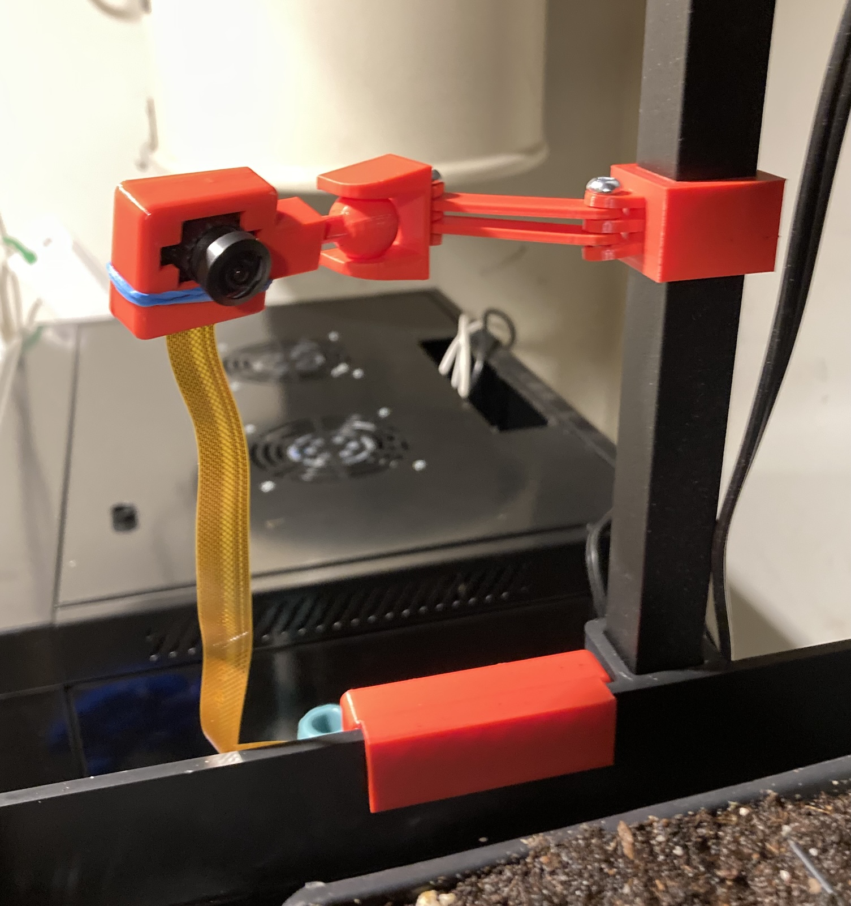
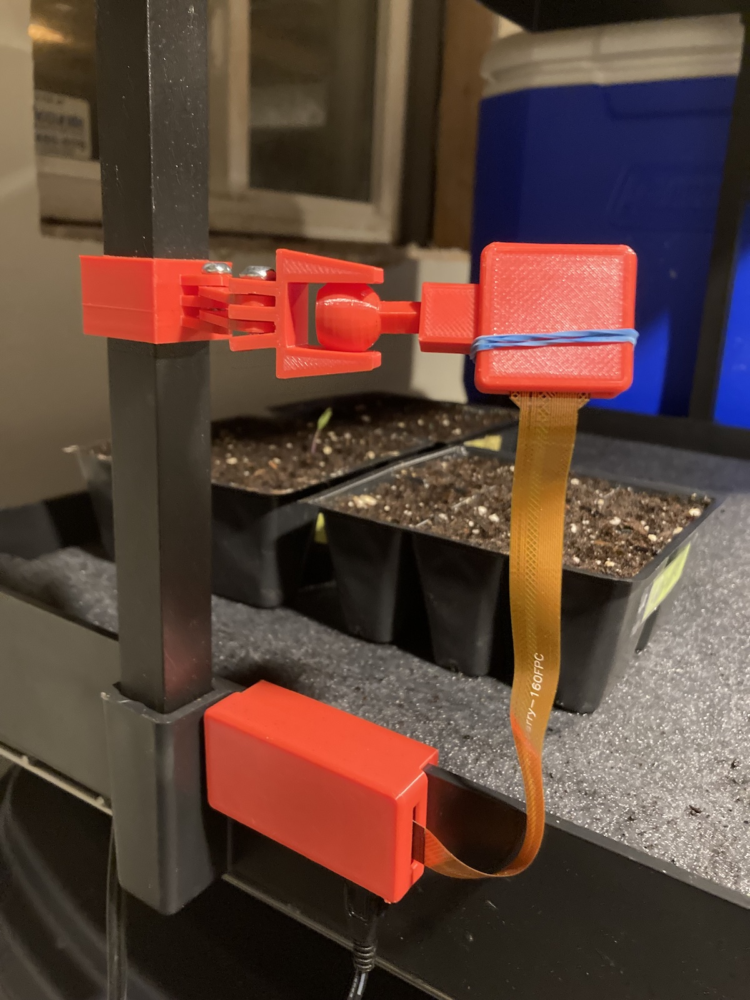
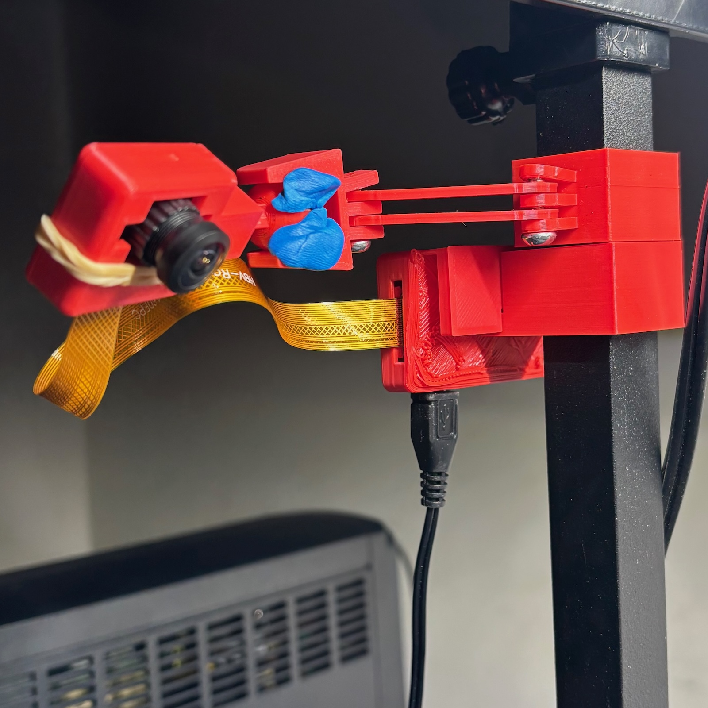
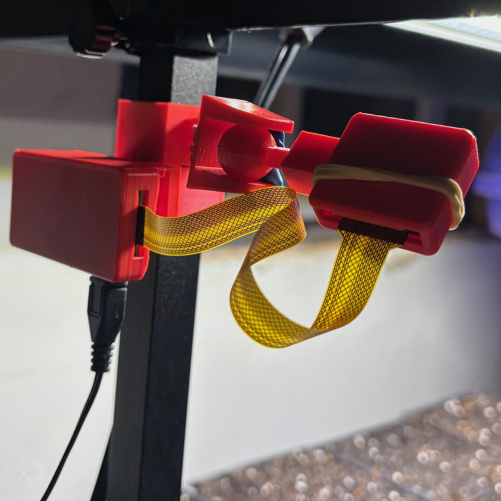

# pi-zero-grow-light

A collection of STL files related to the [growing.shiftkey.online](https://growing.shiftkey.online/) project.

## `camera-ball-arm`

This folder contains the components for the camera arm, which supports an ov5647 camera module with a large lens in front.

## `grow-light-clip`

This folder contains components for a clip to attach to a square post, to mount the Pi device close to the camera.

## `pi-zero-case-with-clip`

This folder contains the components for the Raspberry Pi Zero case, designed in a way that can be clipped onto a container and connected to a camera via the supported interface.

## `pi-zero-case-with-modified-clip`

This folder contains the components for the Raspberry Pi Zero case, designed in a way that can be clipped onto a container and connected to a camera via the supported interface.

### Demo

### First version

### Second version

